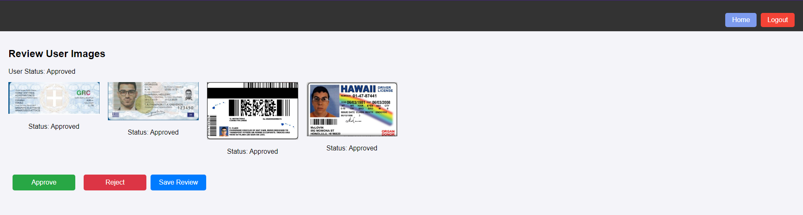

# Car Rental System

A Car Rental System that allows users to rent cars, manage bookings, and view available vehicles. The project is divided into two main components:

- **Frontend**: A React-based admin dashboard for managing the car rental system.
- **Android App**: An Android app that interacts with the backend and allows users to rent cars on mobile devices.

---

## Table of Contents

- [Project Description](#project-description)
- [Tech Stack](#tech-stack)
- [Frontend Setup](#frontend-setup)
- [Android App Setup](#android-app-setup)
- [Features](#features)
- [PHP Scripts](#php-scripts)
  - [Setting Up the PHP Scripts](#setting-up-the-php-scripts)
- [Screenshots](#screenshots)
  - [Admin Dashboard (Frontend)](#admin-dashboard-frontend)
  - [Android App](#android-app)
- [License](#license)


---

## Project Description

The **Car Rental System** is a web and mobile solution designed to help users manage and rent vehicles. The system consists of two parts:

- **Frontend (Admin Dashboard)**: A React application that allows administrators to manage the list of cars, view rental histories, and manage user bookings.
- **Android App**: An Android mobile application for users to browse available cars, make bookings, and manage their rental history.

---

## Tech Stack

### Frontend

- **React**: A JavaScript library for building user interfaces.
- **Firebase**: Used for database (Firestore), authentication, and cloud storage.
- **CSS**: For styling the application.

### Android App

- **Java**: Programming language for the Android app.
- **Firebase**: Used for backend functionalities such as user authentication, storing rental data, and cloud storage.

---

## Frontend Setup

To set up the **Frontend** project on your local machine:

1. Clone the repository:
   ```bash
   git clone https://github.com/GioKars/Car-Rental-System.git
   cd Car-Rental-System/frontend
   ```
2. Install the dependencies:
   ```bash
   npm install
   ```
3. Create firebase.js file and add your Firebase credentials:
   ```bash
   // src/firebase.js
    import { initializeApp } from "firebase/app";
    import { getFirestore } from "firebase/firestore";
    import { getStorage } from "firebase/storage";
    import { getAuth } from "firebase/auth";
    
    const firebaseConfig = {
      apiKey: 'YOUR_API_KEY',
      authDomain: 'YOUR_AUTH_DOMAIN',
      databaseURL: 'YOUR_DATABASE_URL',
      projectId: 'YOUR_PROJECT_ID',
      storageBucket: 'YOUR_STORAGE_BUCKET',
      messagingSenderId: 'YOUR_MESSAGING_SENDER_ID',
      appId: 'YOUR_APP_ID',
      measurementId: 'YOUR_MEASURMENT_ID'
    };
    
    // Initialize Firebase
    const app = initializeApp(firebaseConfig);
    
    // Export Firebase services
    export const db = getFirestore(app);
    export const storage = getStorage(app);
    export const auth = getAuth(app);
    ```
4. Start the React app:
   ```bash
   npm start
   ```
  Your React app should now be running on http://localhost:3000.

---

## Android App Setup

To set up the **Android App** on your local machine, follow these steps:

### Prerequisites

- **Android Studio** installed on your system.
- A **Firebase account** to set up authentication and database integration.

### Setup Instructions

1. Clone the repository:
   ```bash
   git clone https://github.com/GioKars/Car-Rental-System.git
   cd Car-Rental-System/android
   ```
2. Open the project in Android Studio.
3. Add your Firebase configuration:
   * Go to the Firebase Console, create a new project, and register your app.
   * Download the google-services.json file from Firebase.
   * Place the google-services.json file into the app/ directory of your Android project.
4.Add Firebase SDK dependencies: In the build.gradle files, ensure you have the necessary Firebase dependencies:
  * In the project-level build.gradle file:
    ```bash
    classpath 'com.google.gms:google-services:4.3.15'
    ```
  * In the app-level build.gradle file:
    ```bash
    apply plugin: 'com.google.gms.google-services'
    dependencies {
        implementation 'com.google.firebase:firebase-auth:21.0.5'
        implementation 'com.google.firebase:firebase-firestore:24.4.3'
        implementation 'com.google.firebase:firebase-storage:20.2.0'
        // Add any other Firebase libraries as needed
    }
    ```
5. Sync your Gradle files by clicking "Sync Now" in Android Studio.
6. Run the app:
   * Select a device or emulator in Android Studio and click Run to build and launch the app on your device.
   * Your Android app should now be running and ready to interact with Firebase and the car rental system.

## Features

### Frontend (Admin Dashboard)
* User Management: View and manage users and their rental history.
    * Edit user info
    * Ban user
    * Review the user ID and Driver License
* Firebase Integration: Uses Firebase for user authentication and storing data.
* Responsive Design: Fully responsive design for better user experience on different screen sizes.

### Android App (User App)
* User Authentication: Sign up, login, and authentication using Firebase.
* Upload ID and Driver License images
* Browse Cars: View available cars with detailed information.
* Car Rental: Users can rent cars, and view his rental history.
---
## PHP Scripts

The system includes two PHP scripts to manage image uploads and retrieval for local storage using XAMPP:

1. **`upload_image.php`**  
   This script handles uploading images and storing them in user-specific directories.  
   It requires the `userId` parameter in the request to organize uploads by user.

2. **`list_files.php`**  
   This script retrieves a list of uploaded images for a specific user.  
   It requires the `userId` parameter to fetch files from the corresponding directory.

### Setting Up the PHP Scripts

#### Prerequisites
- **XAMPP** or another PHP server installed on your system.
- Place the PHP scripts (`upload_image.php` and `list_files.php`) in the `htdocs` directory of your XAMPP installation.

#### Instructions

1. **Start the XAMPP server:**
   - Launch the XAMPP Control Panel and start the **Apache** and **MySQL** services.

2. **Place the PHP scripts:**
   - Copy `upload_image.php` and `list_files.php` into a folder inside the `htdocs` directory (e.g., `htdocs`).

## Screenshots

### Admin Dashboard (Frontend)




### Android App


## License

This project is licensed under the [MIT License](LICENSE) - see the LICENSE file for details.
